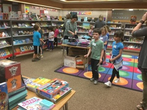
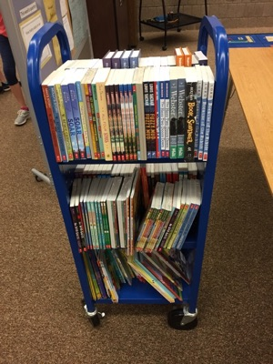
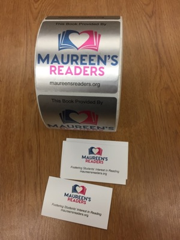

The spring BOGO Book Fair was held at Rice Lake Elementary, Maple Grove, MN. on May 29, 2019. This event gets kids primed for summer reading (and a good deal at the buy one, get one format). Maureen’s Readers bought 200 books at this event.

Books were selected for readers grades K-5. A list of kids who would most benefit from getting a book to call their own was obtained from the teachers. The next day 110 books were anonymously put in the back packs of the kids.

The reaction of the staff at Rice Lake was touching. Some teachers described the joy of the kids when they found the book in their back pack. The unanimous positive feedback from the staff was reassuring regarding this project. The 90 leftover books were given to the media specialist who will use them in the fall book exchange.

We are now looking forward to providing books for the proposed Book Club that the PTO will try to implement next school year. Because we are a brand new organization, we are focused on Rice Lake, but we will be contacting other schools to offer similar help and will consider other programs that get books into the hands of kids.

We will work diligently to spend our assets prudently, providing books or supporting programs that develop an interest in reading. We invite comments and ideas!

